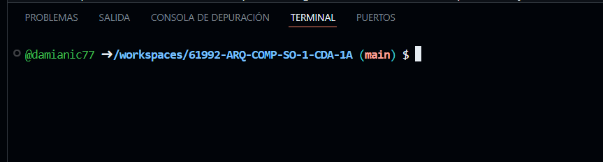
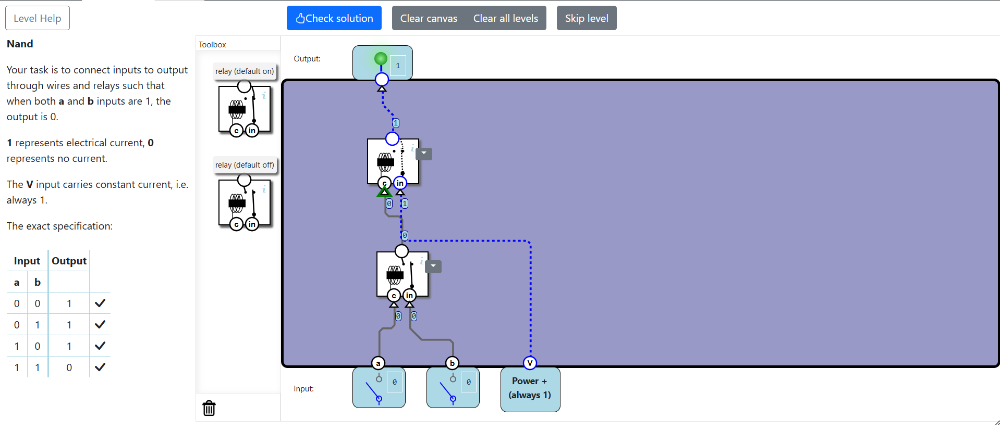
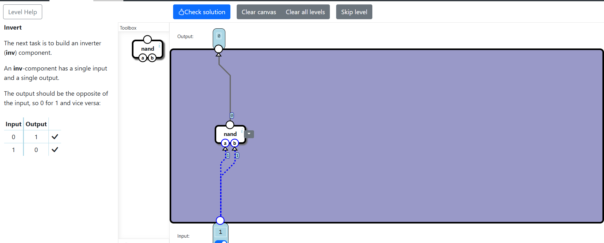
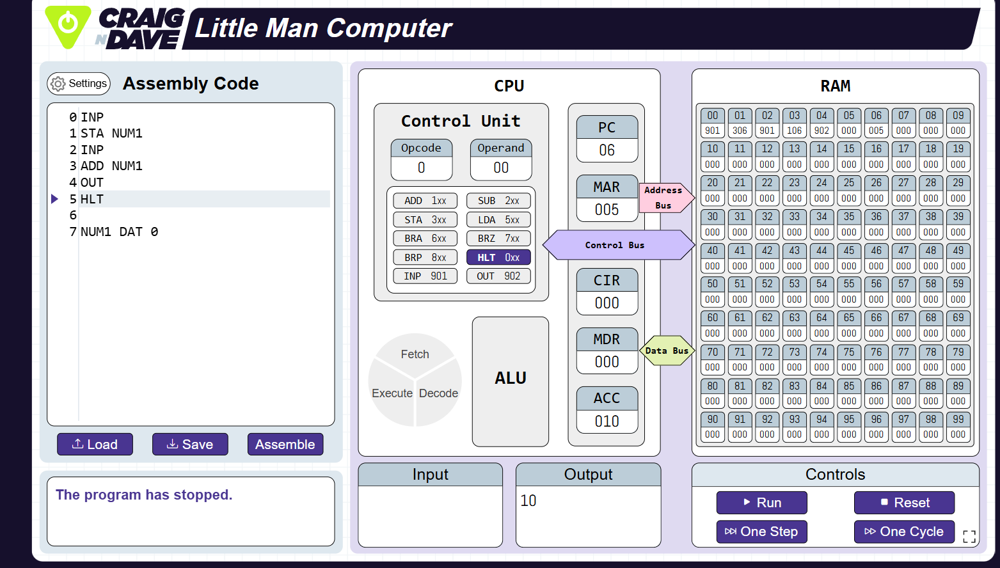

# 61992-ARQ-COMP-SO-1-CDA-1A
Repo for the course

## DAMIAN IZA

Hola *mundo*

Chao **mundo**

**Nivel 1**

Resolvi este nivel gracias a un video del canal Leadus, el canal esta en ingles, por lo que tuve que traducirlo, donde entendi que como a y b estan apagados lo que representa 0, el interruptor de abajo no transmite energia, al no recibir energia de arriba se mantiene cerrado por defecto, dejando pasar corriente **V**, la energia sube y enciende la luz lo que representa 1.

**Nivel 2**

Este nivel lo resolvi solo, use la logica de que abajo tenia un interruptor, al momento de encenderlo representaba 0 y al momento de apagarlo representaba 1, use la compuerta logica NAND, conecte los puetos a y b al interruptor.

**Llegue esta este nivel por motivos de tiempo**

## LITTLE MAN COMPUTER

**Explicacion:**

Primera el contador del programa se dirije a la direccion , lee la intruccion y la lleva al registro de intruccion.La Control Unit lee el codigo del programa.

EL OPCODE esa la operacion matematica y el Operand nos indica que el numero a sumar esta guardado en la memporia, el MAR recibe la direccion , EL BUS DE DATOS viaja a la RAM cuando ocurre esto lee el contenido de la casilla y lo carga en la MDR es decir el Registro de datos de la memoria.

Por ultimo ALU realiza la suma en lenguaje binario con el valor de ACC(5) y con el valor traido  desde la MEMORIA(5), lo que nos da 10.